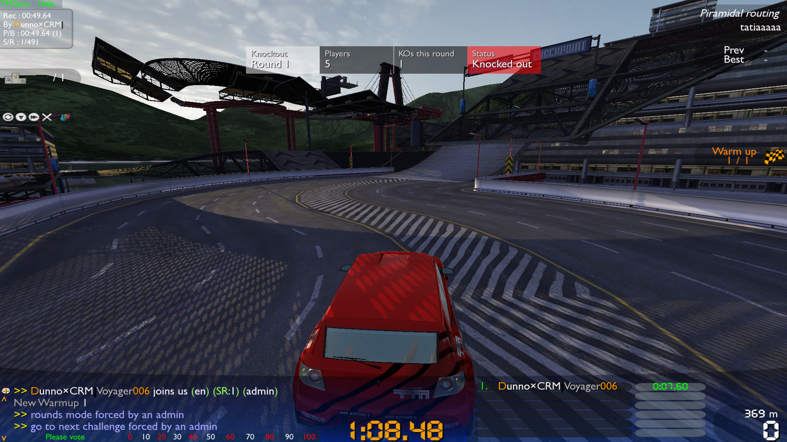
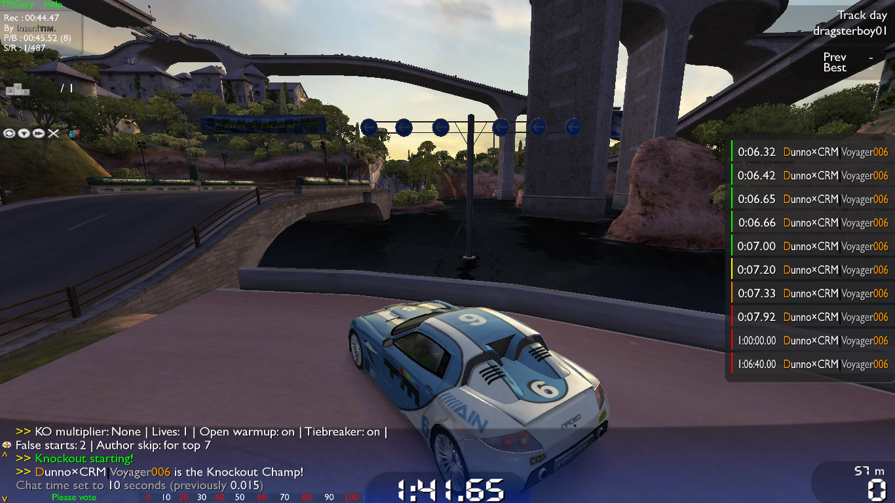
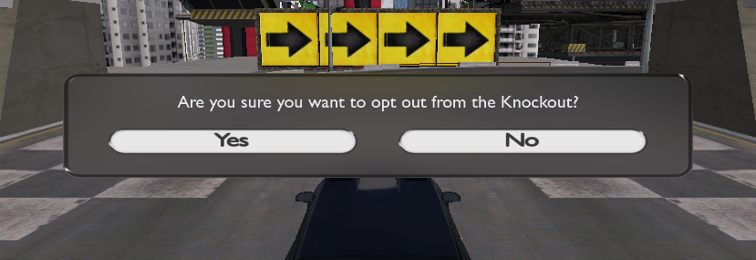

# GeryKnockout
Knockout plugin for the TMGery server controller.

## About
This repository contains a plugin for TMGery that enables knockout competitions to be held. Each round, the last players to finish, or those who don't finish, are knocked out until one player remains as the winner.

## Prerequisites
- Trackmania dedicated server
- PHP 5.3 or higher
- TMGery
- DedDerek's plugin manager

## Installation
Copy the contents of `plugins` to the plugins folder of your TMGery installation, then append the following to `plugins.txt`:

```
plugins\plugin.knockout.php
```

Most of the CLI requires admin access. To specify who are admins on the server, add their logins to the `$admin` and `$admin2` arrays in `includes\tm_gery_config.php`.

Then, restart the controller (using `/die` in-game or rebooting the script) to apply the changes.

## Setting up for development
Clone this repository to a folder of your choice. Using Visual Studio Code and PHP Intelephense is recommended. Using this setup, copy `tm_gery.php`, `includes\plugin_manager.php` and `includes\GbxRemote.php` from the TMGery installation to a new top level folder `dependencies`.

## Features
- Support for Rounds, Time Attack, Stunts
- Multiple KOs per round
- Multiple rounds per track (in Rounds)
- Multiple lives per player
- Allow knocked out players to play during warmup
- Automatically put players who join the server to play if eligible and to spec if not eligible
- Automatic skip if track author is in the knockout (for top X players)
- Custom tiebreaker mode
- Support for multiple rounds per track
- Detect players who retire before the countdown
- Status bar showing knockout and player status
- Scoreboard with color codes (also displayed in Time Attack and Stunts)
- CLI for interacting with the knockout
- Information about the knockout with `/info`
- Players who don't want to play can opt out

## Details
More detailed information can be found in the docs folder:

- [CLI reference](https://github.com/ManiaExchange/GeryKnockout/blob/main/docs/cli.md)
- [User guide](https://github.com/ManiaExchange/GeryKnockout/blob/main/docs/user-guide.md)

## Reporting an issue
If you encounter a bug or a plugin crash, [report it here](https://github.com/ManiaExchange/GeryKnockout/issues/new/choose). Try to supply the following information:

- What happened prior to the bug/crash
- A snapshot using `/ko status` (if the plugin didn't crash)
- The log in the console window (if you have access)

If you're able to, set `MinimumLogLevel` to `Log::Debug` in `plugin.knockout.php` in order to get more information in the console window. Note that this may have a negative impact on the server performance, so only do this temporarily.

Have a suggestion? [Suggest it here](https://github.com/ManiaExchange/GeryKnockout/issues/new/choose).

## Screenshots






## The team
- [@Voyager006](https://github.com/Voyager006) - main plugin work, documentation
- [@stefan-baumann](https://github.com/stefan-baumann) - dynamic KO multiplier algorithm, graphs

## Credits
- MrA for suggesting a progressive KO multiplier
- Dennis for suggesting the syntax for the `/ko lives` command
- Realspace for suggesting the tiebreaker mode
- CavalierDeVache for the original plugin
- Mikey for the original concept (Madhouse Knockout)
- All the hosters of the TMX Knockout for keeping it running throughout the years
- And everyone who joined the TMX Knockout server to help testing out the plugin!
