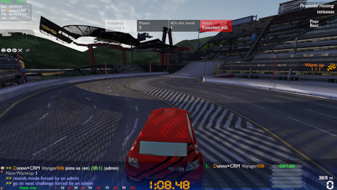
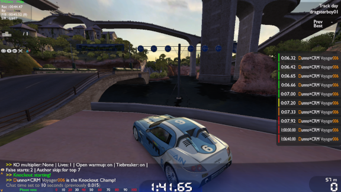

# GeryKnockout
Knockout plugin for the TMGery server controller.

[CLI reference](docs/cli.md) | [User guide](docs/user-guide.md) | [Report a bug](https://github.com/ManiaExchange/GeryKnockout/issues/new?assignees=&labels=bug&template=bug_report.md&title=) | [Suggest a feature](https://github.com/ManiaExchange/GeryKnockout/issues/new?assignees=&labels=new+feature&template=feature_request.md&title=)

## About
This repository contains a plugin for TMGery that enables knockout competitions to be held. Each round, the last players are knocked out until one player remains. This plugin is used in the TMX Knockout United event, hosted every Friday at 22:00 CE(S)T in TrackMania United Forever.

## Prerequisites
- Trackmania Forever dedicated server
- PHP 5.3 or later
- TMGery v2020-12-04 or later
- DedDerek's plugin manager 0.23 or later

## Installation
Unzip [the latest release](https://github.com/ManiaExchange/GeryKnockout/releases) into your TMGery installation, then append the following to `plugins.txt`:

```
plugins\plugin.knockout.php
```

Most of the CLI requires admin access. To specify who are admins on the server, add their logins to the `$admin` and `$admin2` arrays in `includes\tm_gery_config.php`.

Then, restart the controller (using `/die` in-game or rebooting the script) to apply the changes.

## Development
Clone this repository to a folder of your choice. Using Visual Studio Code, [PHP Intelephense](https://marketplace.visualstudio.com/items?itemName=bmewburn.vscode-intelephense-client) and [EditorConfig for VS Code
](https://marketplace.visualstudio.com/items?itemName=EditorConfig.EditorConfig) is recommended. Using this setup, copy `tm_gery.php`, `includes\GbxRemote.php`, `includes\plugin_manager.php` and `includes/tm_gery_config.php` from your TMGery installation to a new top level folder `dependencies`. Files in this folder are ignored by `.gitignore`, so you should see them grey out.

## Contribution
You may contribute to this project by [reporting bugs](https://github.com/ManiaExchange/GeryKnockout/issues/new?assignees=&labels=bug&template=bug_report.md&title=), [suggesting new features](https://github.com/ManiaExchange/GeryKnockout/issues/new?assignees=&labels=new+feature&template=feature_request.md&title=) or creating pull requests that addresses particular issues. Please consult the [code of conduct](https://github.com/ManiaExchange/GeryKnockout/blob/main/CODE_OF_CONDUCT.md) and [contribution guidelines](https://github.com/ManiaExchange/GeryKnockout/blob/main/CONTRIBUTING.md) before doing so. If you want to report a security vulnerability, please review our [security policy](https://github.com/ManiaExchange/GeryKnockout/security/policy).

## Screenshots




## The team
- [@Voyager006](https://github.com/Voyager006) - main plugin work, documentation
- [@stefan-baumann](https://github.com/stefan-baumann) - dynamic KO multiplier algorithm, graphs

## Thanks to...
- MrA for suggesting a progressive KO multiplier
- Dennis for suggesting the syntax for the `/ko lives` command
- Realspace for suggesting the tiebreaker mode
- CavalierDeVache for the original plugin
- Mikey for the original concept (Madhouse Knockout)
- All the hosters of the TMX Knockout for keeping it running throughout the years
- And everyone who joined the TMX Knockout server to help testing out the plugin!
