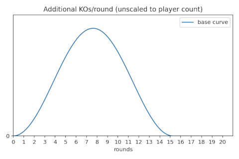
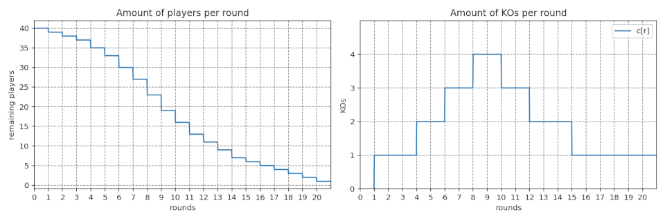
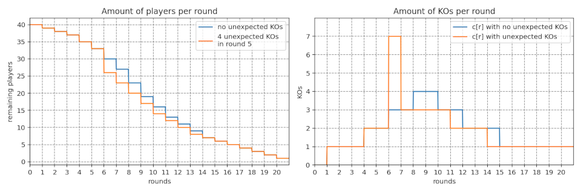

# User guide

## Introduction
With this plugin installed, you can run and manage knockout events on your dedicated server. This guide describes the knockout format, plugin features, knockout settings and changes compared to previous versions.

## The knockout format
The knockout is based on knocking out the slowest drivers each round. If there is 1 KO per round, the last player will be knocked out. With 2 KOs, the bottom two are knocked out.

If players do not finish (DNF), they will also be knocked out. This has the side effect that multiple players may be knocked out, even if there is only supposed to be 1 KO per round.

This is then repeated until there is one player remaining. This player is the only one who has not been knocked out and is therefore crowned as the winner.

Supported game modes include Rounds, Time Attack and Stunts. Laps, Cup and Team are currently not supported.

## Command-line interface
The plugin includes a command-line interface which can be used to configure the knockout.

To start the knockout, use [/ko start](https://github.com/ManiaExchange/GeryKnockout/blob/main/docs/cli.md#ko-start-now). This command may be combined with others depending on the usage:

- `/ko start`
    - If warmup, starts the knockout after the warmup
    - If not warmup, schedules the knockout to start on the next round (or next track if it's the last round)
    - If podium, starts the knockout on the next track
- `/ko start now`
    - Skips the current track and starts the knockout on the next track
- `/ko start` -> `/ko skip`
    - Skips the current track and starts the knockout on the next track
- `/ko start` -> `/ko skip warmup`
    - Skips the current warmup and starts the knockout
- `/ko start` -> `/ko restart`
    - Restarts the current track without warmup (or ends the warmup if there is one) and starts the knockout
- `/ko start` -> `/ko restart warmup`
    - Restarts the current track with a warmup and starts the knockout

When starting the knockout, all players are put to play. If someone doesn't want to play, let them know about [opting out](#opting-out).

During the knockout, the following commands may be used:

- [/ko skip [warmup]](https://github.com/ManiaExchange/GeryKnockout/blob/main/docs/cli.md#ko-skip-warmup) - skips the current warmup or track
- [/ko restart [warmup]](https://github.com/ManiaExchange/GeryKnockout/blob/main/docs/cli.md#ko-restart-warmup) - restarts the current round or track
- [/ko add *login*](https://github.com/ManiaExchange/GeryKnockout/blob/main/docs/cli.md#ko-add-login--) - adds a single player to the knockout
- [/ko add *](https://github.com/ManiaExchange/GeryKnockout/blob/main/docs/cli.md#ko-add-login--) - adds all players to the knockout
- [/ko remove *login*](https://github.com/ManiaExchange/GeryKnockout/blob/main/docs/cli.md#ko-remove-login--) - removes a single player from the knockout
- [/ko remove *](https://github.com/ManiaExchange/GeryKnockout/blob/main/docs/cli.md#ko-remove-login--) - removes all players from the knockout
- [/ko lives *login* *lives*](https://github.com/ManiaExchange/GeryKnockout/blob/main/docs/cli.md#ko-lives-login------lives) - sets the given number of lives for a single player
- [/ko lives * *lives*](https://github.com/ManiaExchange/GeryKnockout/blob/main/docs/cli.md#ko-lives-login------lives) - sets the given number of lives for all player
- [/ko stop](https://github.com/ManiaExchange/GeryKnockout/blob/main/docs/cli.md#ko-stop) - stops the knockout with immediate effect

The knockout can be further customized by the following settings:

- [/ko multi (constant *kos* | extra *per_x_players* | dynamic *total_rounds* | none)](https://github.com/ManiaExchange/GeryKnockout/blob/main/docs/cli.md#ko-multi-constant-kos--extra-per_x_players--dynamic-total_rounds--none) - perform multiple KOs per round
- [/ko openwarmup (on | off)](https://github.com/ManiaExchange/GeryKnockout/blob/main/docs/cli.md#ko-openwarmup-on--off) - lets players drive during warmups
- [/ko falsestart *max_tries*](https://github.com/ManiaExchange/GeryKnockout/blob/main/docs/cli.md#ko-falsestart-max_tries) - sets the limit for how many times a round is restarted because of someone retiring before it starts
- [/ko tiebreaker (on | off)](https://github.com/ManiaExchange/GeryKnockout/blob/main/docs/cli.md#ko-tiebreaker-on--off) - use a custom tiebreaker mode in case of ties
- [/ko authorskip *for_top_x_players*](https://github.com/ManiaExchange/GeryKnockout/blob/main/docs/cli.md#ko-authorskip-for_top_x_players) - skip tracks if the author is participating

These settings are displayed when starting the knockout, but you can use `/ko settings` to display them as well.

Public info messages are shown in white ($fff), non-public info messages in grey ($aaa) and error messages in red ($f00).

A full overview of the commands is listed in [cli.md](https://github.com/ManiaExchange/GeryKnockout/blob/main/docs/cli.md).

## Features

### Allow knocked out players to play during warmup
Players who have been knocked out are able to play during warmups if open warmups are enabled. This does not apply to spectators; if a player wants to be spectating instead, they can enter spectator mode during a warmup. Same thing applies the other way; if a spectator wants to play during warmups, leave spectator mode during a warmup.

Use [/ko openwarmup](https://github.com/ManiaExchange/GeryKnockout/blob/main/docs/cli.md#ko-openwarmup-on--off) to set this functionality.

### Force players in after disconnecting

Players may be able to be automatically put back in the knockout if they disconnected but rejoin in time. This is valid as long as the given player is not knocked out yet. If there is a disconnection during the warmup, they may rejoin until the next live round has ended.

Currently, players are knocked out at the end of each round; which means that a player may reconnect during a live round and attempt to finish.

If a player joins the server, they'll be forced in if they are eligible. If not, their status will be `Knocked out` if they joined using *Play* and `Spectating` if they joined as a spectator. The plugin does not put a password on the server during a knockout. When the knockout is stopped, everyone is free to play unless a password is set manually.

Likewise, if someone disconnects during a knockout, they will be eligible to join

### Tiebreakers
When a round ends and there is a tie among players who risk getting knocked out and players who don't, there is an ambiguity as of who shall be knocked out. If tiebreakers are enabled, the script will enter a custom tiebreaker mode when this happens. The current round will be restarted with the tied players only, while surviving players are temporarily put to spec (shelved). Once the tiebreaker ends, the knockout resumes as normal on the next round.

As an example, imagine the following standings in a round with 1 KO:

```
Player 3    0:49.14
Player 1    0:51.25
Player 4    0:52.99
Player 5    0:53.57
-------------------
Player 2    0:53.57
```

Since player 2 and 5 are tied, they will enter tiebreaker mode while player 1, 3 and 4 become shelved. Afterwards, the winner of the tiebreaker will rejoin the knockout with player 1, 3 and 4.

Now, an example with multiple KOs:

```
Player 3    0:56.26
...
Player 8    1:02.50
Player 12   1:02.78
-------------------
Player 9    1:02.78
Player 4    1:02.78
Player 20   1:20.03
```

In this case, player 20 will be knocked out regardless. However, players 4, 9 and 12 are tied and will therefore enter tiebreaker mode. In the tiebreaker, there will be 2 KOs performed since two of the players would have been knocked out otherwise.

Tiebreakers will not initiate if the tied players DNF.

This mode can be disabled using [/ko tiebreaker](https://github.com/ManiaExchange/GeryKnockout/blob/main/docs/cli.md#ko-tiebreaker-on--off). If disabled, ties are broken by when they were submitted; times which are set earlier are preferred.

It is recommended to disable this mode if you intend to [play several rounds per track](https://github.com/ManiaExchange/GeryKnockout/blob/main/docs/user-guide.md#rounds-per-track).

### KO multiplier
You can control how many KOs are performed each round by using a KO multiplier; useful if there are many players and limited time. These are the following multipliers that may be used:

| Multiplier | Command | Description |
| :-- | :-- | :-- |
| None | [/ko multi none](https://github.com/ManiaExchange/GeryKnockout/blob/main/docs/cli.md#ko-multi-constant-kos--extra-per_x_players--dynamic-total_rounds--none) | No multiplier; 1 KO per round. |
| Constant | [/ko multi constant *kos*](https://github.com/ManiaExchange/GeryKnockout/blob/main/docs/cli.md#ko-multi-constant-kos--extra-per_x_players--dynamic-total_rounds--none) | A constant number of KOs per round. |
| Extra | [/ko multi extra *per_x_players*](https://github.com/ManiaExchange/GeryKnockout/blob/main/docs/cli.md#ko-multi-constant-kos--extra-per_x_players--dynamic-total_rounds--none) | An extra KO per X players. If `per_x_players` = 10 then there will be 1 KO for 2-10 players, 2 KOs for 11-20, 3 KOs for 21-30, and so on. |
| Dynamic | [/ko multi dynamic *total_rounds*](https://github.com/ManiaExchange/GeryKnockout/blob/main/docs/cli.md#ko-multi-constant-kos--extra-per_x_players--dynamic-total_rounds--none) | A hybrid algorithm which aims for `total_rounds` rounds throughout the knockout. It starts off with 1 KO per round, then progressively increases the KO count towards the middle and goes gradually back down to 1 KO for the final rounds. |

#### How the dynamic multiplier works
Among these multipliers, Dynamic is without doubt the most advanced one, so let's take a moment to see how it works. In essence, it is about approximating the total number of KOs such that the total number of rounds equals the desired number of rounds.

First, a base curve `base_curve(r)` is defined. It defines the relative amount of additional KOs per round `r` over the baseline of 1 KO/round.



Then, the goal is to find a discretized, scaled curve `c[r] = [a * base_curve(r)] + 1` such that the sum over `c[r]` for all rounds equals the total number of KOs to be performed. This is done by approximation; we start off with an initial value of `a` and calculate the sum of `c[r]`. If the sum is too small, `a` is incremented; too big and `a` is decremented. This is repeated until we find a value for `a` of which the sum of `c[r]` equals the total number of KOs.

With 40 players, 20 rounds and no unexpected KOs, the number of KOs/round and overall player count will look like the following:



Each round, the curve is recalculated to adjust for any inaccuracies. In the case of a mass KO, the curve adjusts itself because the remaining number of KOs becomes reduced, thus leading to a more straightened curve. The graphs below show how, in the same 40 player knockout, the curve is adjusted after a round with 4 additional DNFs (7 players knocked out):



The base curve is defined in a way that there will always be 1 KO for the last 4-5 rounds, regardless of the player and KO count. Whether it will be 4 or 5 rounds depends on the possible solutions for the scaled curve. Because of the fact that we deal with discrete space, there is a small chance that the curve may not be solvable. In this case, the curve is readjusted ("smoothed") by 1 KO for that round only.

Using this approach, we can observe that the number of KOs/round will increase and decrease steadily; the number of KOs/round will not increase, then decrease, then increase again (and vice versa), unless there are unexpected KOs.

### Lives
Players may be configured to have multiple lives. This can be configured before the start of the knockout, or while a knockout is in progress. By default, each player has 1 life.

When a player gets last, they will lose a life. If it was their last life, they will get knocked out.

The command to use is [/ko lives (*login* | *) [[+ | -]*lives*]](https://github.com/ManiaExchange/GeryKnockout/blob/main/docs/cli.md#ko-lives-login------lives). The number of lives may be relative (by using a + or - sign in front of the number) or absolute.

### Rounds per track
If you want to play several rounds per track in Rounds, set the number of rounds as the point limit. The plugin overrides the current points partition with a custom one where each finisher gets 1 point.

Note: it is recommended to disable tiebreakers and use 1 life for each player to avoid unwanted side effects.

### False starts
The plugin includes false start detection, as TMGery does not provide this natively. If someone retires before the race starts, the round will be restarted. This is limited to two times per round by default, but can be adjusted or disabled using [/ko falsestart *max_tries*](https://github.com/ManiaExchange/GeryKnockout/blob/main/docs/cli.md#ko-falsestart-max_tries).

### Automatic skip of author tracks
When proceeding to the next track, and with few players in the knockout, the script will skip the next track if the author is still in. This is to prevent excessive advantage by playing their own tracks in the final rounds. When and if this should kick in is determined by [/ko authorskip *for_top_x_players*](https://github.com/ManiaExchange/GeryKnockout/blob/main/docs/cli.md#ko-authorskip-for_top_x_players); the default is to be enabled for top 7, but can be disabled by setting to 0.

## HUD
The plugin includes a status bar showing knockout status and player status, and a scoreboard showing which players are in risk of getting knocked out.

### Status bar

The status bar can be disabled by clicking the TMGery button on the top left - in that case, the information will be shown in chat instead. The status bar may display the following states throughout a knockout:

Knockout status    | Description
:--------------    | :----------
`Warmup`           | Warmup phase. No KOs are performed.
`Skipping warmup`  | Warmup phase is being skipped by using `/ko skip warmup`. No KOs are performed.
`Running`          | Knockout is live. Displays "Round x". KOs are performed at the end of the round unless no one finishes.
`Restarting round` | Round is being restarted by using `/ko restart`. No KOs are performed.
`Restarting track` | Track is being restarted by using `/ko restart warmup`. No KOs are performed.
`Skipping track`   | Track is being skipped by using `/ko skip`. No KOs are performed.
`Tiebreaker`       | Tiebreaker mode among tied players. Non-participating players are put to player status `Shelved`.

Player status | Description
:------------ | :----------
`Playing`     | Participating in the knockout.
`Knocked out` | Out of the knockout, but can play during warmups.
`Spectating`  | Out of the knockout, and won't be playing during warmups.
`Shelved`     | Temporarily put aside for a tiebreaker. Once the tiebreaker is over, shelved players will be playing again.
`Opting out`  | In the process of opting out of the knockout, but can still rejoin using `/opt in`.

Note: this list is not exhaustive - there are some additional states that are not displayed in the status bar.

### Scoreboard

The scoreboard is shown when someone have finished or DNFs in Rounds, and always in Time Attack and Stunts. It is then hidden when proceeding to the next round or entering the podium. It is not shown during warmups.

The colors in the scoreboard represent the following:

Color | Description
:---- | :----------
🟩     | Safe from getting knocked out. Always shown for 1st place.
🟨     | 2 places from being knocked out.
🟧     | 1 place from being knocked out.
🟥     | In danger of being knocked out.

## Opting out
A player may choose to opt out of the knockout using [/opt out](https://github.com/ManiaExchange/GeryKnockout/blob/main/docs/cli.md#opt-out). Doing so in the middle of a live round will make them retire and DNF, regardless of whether they finished or not. Otherwise, they may still change their mind using [/opt in](https://github.com/ManiaExchange/GeryKnockout/blob/main/docs/cli.md#opt-in), as long as they do so by the time the next live round starts.

A confirmation window will appear when opting out to ensure that the player opts out only if they really want to.

## Upgrading from previous versions

### From v.082.9

Version 2.0.0 comes with some breaking changes. First, it requires a newer version of TMGery and the plugin manager, which support the `EndRound` callback. Without this callback, no KOs will be performed.

Secondly, there are also some changes concerning the CLI:

- Commands now use the same format as in the MX Knockout, which means that they follow the pattern `/kostart` -> `/ko start`.
- `/ko start` will not skip to next track by default. To immediately skip to the next track, use `/ko start now`.

Updated admin commands:

Old syntax   | New syntax
:----------- | :-----------
/kostart   | /ko start [now]
/kostop    | /ko stop
/konextmap | /ko skip [warmup]
/korestartmap | /ko restart [warmup]
/koadd *login* </br> /koaddall | /ko add *login* </br> /ko add \*
/koremove *login* </br> /koremoveall | /ko remove *login* </br> /ko remove \*
/komulti *per_x_players* </br> /komulti ko *kos* | /ko multi constant *kos* </br> /ko multi extra *per_x_players* </br> /ko multi dynamic *total_rounds* </br> /ko multi none

New admin commands:

- /ko spec (*login* | \*)
- /ko lives (*login* | \*) [[+ | -]*lives*]
- /ko openwarmup (on | off)
- /ko falsestart *max_tries*
- /ko tiebreaker (on | off)
- /ko authorskip *for_top_x_players*
- /ko settings
- /ko status
- /ko help

New public commands:

- /info
- /opt in
- /opt out

Removed commands:

- /kogetpass
- /kosetpass *password*
- /koJOIN *password*

Because version 2.0.0 has significant changes to internal structure, `/ForcePlay [<login>]` and `/ForcePlayAll` does not put players into the knockout any longer. Use `/ko add <login>` and `/ko add *` instead. You may use `/ForceSpec [<login>]`, but `/ko remove <login>` is recommended as it has immediate effect.

The following bugs have been fixed since v.082.9:

- Fixed bug where the script will KO everyone when starting in the warmup.
- Fixed bug where the script will KO everyone if it didn't execute until next track.
- Fixed bug where you could avoid getting KO by going in spec between tracks.
- Fixed bug where players could rejoin after being forced to spec.
- Fixed bug where a player that has been forced in during warmup is not knocked out if last.
- Fixed bug where forcing a player in as the third player will end the knockout afterwards.
- Fixed bug where the winner of a previous knockout would be crowned as the winner when stopping a knockout manually.
- Patched vulnerability where the script will KO everyone if `/restart` or `/gonext` is used.
- Commands for starting a knockout, restarting a map and skipping a map now work when issued during the synchronization phase; these will take effect after a small delay (when the round starts).

`/restart`, `/gonext` and `/end` can be used interchangeably with `/ko restart`, `/ko skip` and `/ko skip warmup` respectively, as long as no one has finished yet. Though, the new commands offer new functionality such as restarting the current track with a warmup (using `/ko restart warmup`), protection against unwanted KOs if someone have finished, and proper state management (status is reflected in the top bar).

## Known issues
[This list](https://github.com/ManiaExchange/GeryKnockout/issues?q=is%3Aissue+is%3Aopen+label%3Abug) shows currently known bugs.
